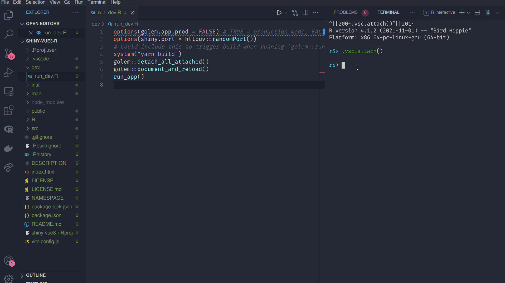

# Shiny + Golem + Vue 3 + Vite

This repo contains an example for using Vue 3 + Vite with a {golem} shiny app.

### Setup

```bash
yarn create vite vite-demo --template vue
cd vite-demo
R -e "golem::create_golem('vite.demo')"
mv vite.demo/* .
rm -r vite.demo /
```

Edit the vite.config.js file to look like this to make sure the built files are in the right location for shiny.

```r
import { defineConfig } from "vite";
import vue from "@vitejs/plugin-vue";

// https://vitejs.dev/config/
export default defineConfig({
  plugins: [vue()],
  build: {
    outDir: "./inst/app/",
    assetsDir: "www",
  },
});

```

`R/run_app.R` should have

```r
ui = shiny::htmlTemplate(system.file("app/index.html", package = "vite.demo"))
```

replace vite.demo with the name of the golem package.

### Run

Use `yarn build` to populate the www/ folder with the built Vue scripts, then use `golem::run_dev()` to start the shiny app.

You could add an additional line to `dev/run_dev.R` like

```r
system("yarn build")

```

so that when running `golem::run_dev()` the Vue components are also rebuilt.



## Recommended IDE Setup

- [VSCode](https://code.visualstudio.com/) + [Volar](https://marketplace.visualstudio.com/items?itemName=johnsoncodehk.volar)
